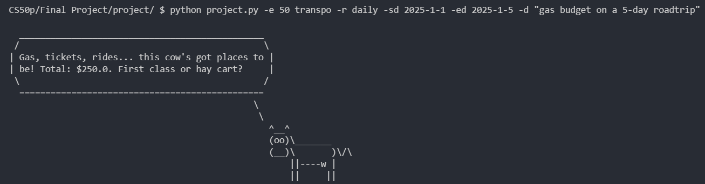

# **MoolaTrack**

#### Video Demo:  <https://youtu.be/GFAF6NbOgSc?si=j0Eztt6uZll_BQj2>

MoolaTrack is a cli-based expense tracking system designed for CLI enthusiasts. It's a platform where users can track their expenses without getting their hands off the keyboard.

MoolaTrack allows users to:
- Add & Remove an expense data
- View expense history and summary
- Set recurrences for an expense, with optional start and end dates.

## Usage

### Adding an expense data:

Use ***-e*** or ***--expense*** flag when adding an expense data. Provide the amount and category. You can also add optional flags like  description ***-d*** and recurrence ***-r*** , that can also be accompanied optionally by start-date ***-sd*** and end-date ***-ed***

#### Examples:
- `python project.py -e 20 food`
- `python project.py -e 10.0 transpo -r daily`
- `python project.py -e 400.0 household -r monthly -d "electric bill`
- `python project.py -e 15 wellness -r monthly -sd 2025-02-06 -d "gym membership"`

#### Categories:

| **Category**               | **Keywords**                        |
|----------------------------|-------------------------------------|
| **Food & Dining**          | *food*, *dining*                    |
| **Leisure & Shopping**     | *leisure*, *shopping*, *shop*       |
| **Transportation**         | *transpo*, *transportation*         |
| **Family & Education**     | *family*, *education*               |
| **Health & Wellness**      | *health*, *wellness*                |
| **Household**              | *household*                         |
| **Other**                  | *other*                             |

#### Recurrences:
- daily
- weekly
- monthly
- yearly

#### Recurrence Computation:

- If the user didn't input a start date, it will be set to when the data is added
- If the user didn't input an end date, it will be set to when the program is run.
- An expense will not be credited (amount will not be saved) if the start date is on the future.

**Examples:**

    let current date = 2025-02-08

    Recurrence: any
    Start date: Beyond current date
    End date: any
    > Credited: 0 * amount

    Recurrence: daily
    Start date: 2025-1-1
    End date: 2025-1-2
    > Credited: 2 * amount

    Recurrence: monthly
    Start date: 2025-1-1
    End date: 2025-2-1
    > Credited: 2 * amount

    Recurrence: monthly
    Start date: 2025-1-31
    End date: 2025-2-28
    > Credited: 1 * amount

    Recurrence: monthly
    Start date: 2024-10-31
    End date: 2025-11-30
    > Credited: 2 * amount

#### Outputs:

### Removing an expense data:
To remove an expense data , use ***-r*** or ***--remove*** flag followed by the expense id.

##### Examples:
- `python project.py -r 1`
- `python project.py --remove 2`

### Viewing expense history:
To view expense history, use ***-a*** or ***--all*** flag.

#### Example:
- `python project.py -a`

##### Output:

### Viewing expense summary:
To view expense history, use ***-s*** or ***--summary*** flag.

#### Example:
- `python project.py -s`

##### Output:

## Files
    > utils.py
        contains helper functions for parsing  arguments, displaying piechart, 
        generating database connection, generating cowsay messages, and mapping categories

    > expense_model.py
        serves as a blueprint for an expense entry, 
        composed of attributes like amount, category, recurrence, description, etc.

    > project.py
        the heart of the program, handling main functionalities such as adding and
        removing expenses, viewing summaries, and tracking expense history.

    > test_project.py
        contains the unit tests for the project, ensuring its functionality and reliability

## Developer Yap
Building this tool helped me become a better programmer. I learned the best practices and how can I apply them, though personally I still hate comments and documentations (￣_,￣ ). I've had a lot of dilemmas while building this, whether to put helper functions on different files, whether to change the folder structure, whether to use this or that design... Eventually though, I learned what to do, and I decided that this is the best design my program can have. I think this is the most beautiful program I've ever made, and I'm proud of it. Although this is just command line tool, I think it will perform well and serve its purpose, I myself needs an expense tracker, and this is just the right tool for me. No BS just Track. Although there's a cow...

### Side Note
This is my final project on CS50's introduction to programming with Python

